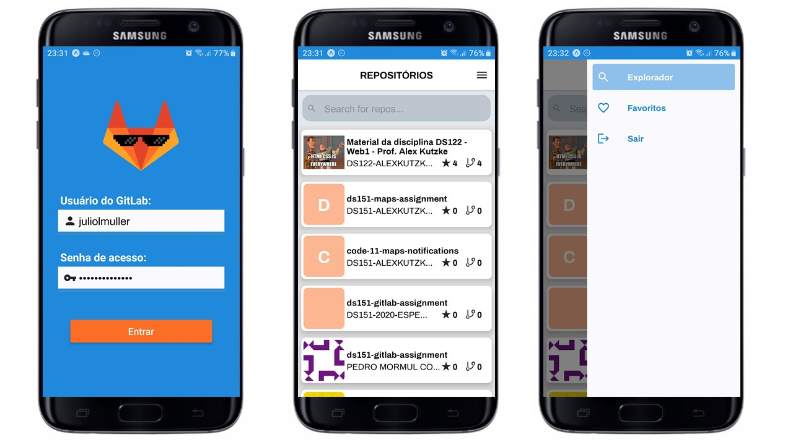

<h1 align="center">
  
</h1>

<p align="center">
  <a href="#trophy-lessons-learned">Lessons Learned</a>&nbsp;&nbsp;&nbsp;|&nbsp;&nbsp;&nbsp;
  <a href="#rocket-technologies--resources">Technologies</a>&nbsp;&nbsp;&nbsp;|&nbsp;&nbsp;&nbsp;
  <a href="#hammer-setting-up-the-environment">Environment Setup</a>
</p>

<p align="center">
  

  

  

  

  
</p>



Application developed as an assignment to college, subject Development for Mobile Devices, at UFPR, in order to learn building **React Native** applications. The project seeks to apply knowledge in functional components, React Navigation, HTTP calls and Context API.

The proposal was to build a simple mobile app to consume GitLab API, implementing an authentication method to be able to navigate inside the app. The application should keep the access token with [AsyncStorage](https://react-native-async-storage.github.io/async-storage/), besides implementing a navigation drawer, using [React Navigation](https://reactnavigation.org/) extension. The usa og a third-party UI library was mandatory. A good-looking app may earn extra points 😍.

## :trophy: Lessons Learned

- Configuring React Context for authentication flow;
- Using React Native AsyncStorage package 😎;
- React Native Elements UI components 😠;
- Complex navigation with React Navigation (*drawer* and *bottom tabs*);
- Holding on splash screen while app is loading resources;
- COnfiguring status bar appearance (Android);
- Fetching data from GitLab API;

## :rocket: Technologies & Resources

**Frontend:**
- React Native
- Expo Framework
- Elements UI
- Axios (HTTP client)
- AsyncStorage

**Development:**
- Visual Studio Code
- NPM routines

## :hammer: Setting up the Environment

Before starting the development server, you need to set up the environment variables in a `.env` file, at the project root. For convenience, you can use `.env.example` as reference, so you'll know all variables available in the application. The most important one is **GITLAB_API_URL**, which points to the GitLab platform you want to fetch data from.

Make sure to have **Node.js 10+** installed in your machine and its **npm** available in the command line, then use the following routines:

```bash
$ npm install   # download all dependencies
$ npm start     # run development server
```
